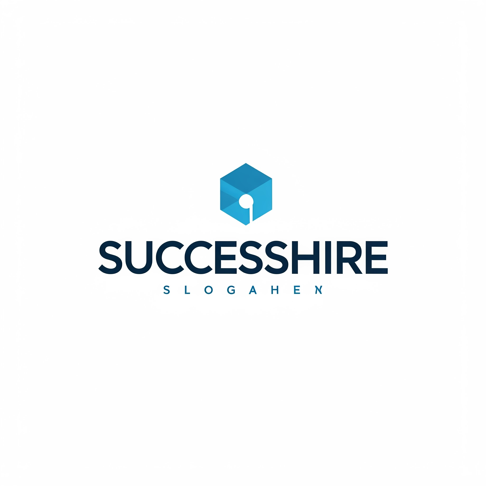

# SuccessHire

  

> **Integrating AI to Connect People**

SuccessHire is a student-led tech organization evolving into a startup with a mission to transform the employment ecosystem using artificial intelligence. We build AI-powered tools that streamline both sides of the hiring equation—empowering candidates and simplifying recruitment for companies.

---

## 🚀 Vision

We believe that the employment journey—from preparing for an interview to making a hiring decision—should be intelligent, accessible, and human-centered. Our mission is to harness the power of AI to make job preparation and talent acquisition more effective, efficient, and personalized.

---

## 🧠 What We Do

### ✅ Empower Candidates
- Realistic AI-powered mock interviews
- Resume analysis & optimization
- Expert feedback, gamified learning, and career insights

### ✅ Support Employers (Coming Soon)
- AI-assisted interview evaluation
- Intelligent candidate screening
- Company-specific question banks and reporting dashboards

---

## 🌟 Flagship Product

### [InterviewArchitect]()  
An AI-powered platform that helps candidates simulate real interviews, receive actionable feedback, and build career confidence through smart preparation.

---

## 💼 Who We Are

SuccessHire is currently led by a group of passionate student developers, designers, and AI researchers. We aim to launch as a startup, with products that redefine how individuals connect with opportunities.

---

## 🔗 Get Involved

We welcome:
- Collaborations with universities and startups
- AI engineers, developers, and designers who share our mission
- Early partners or sponsors for product pilots

📬 Reach out: [successhire.contact@gmail.com](mailto:successhire.contact@gmail.com)  
🌐 [Website](https://successhire.ai) (coming soon)

---

> “Integrating AI to connect people — because every great hire starts with better tools.”
